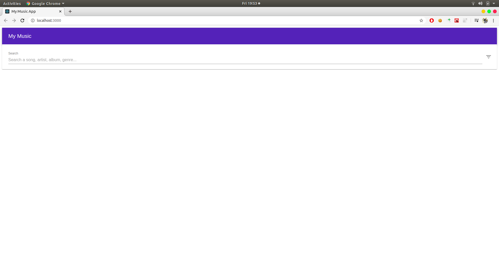
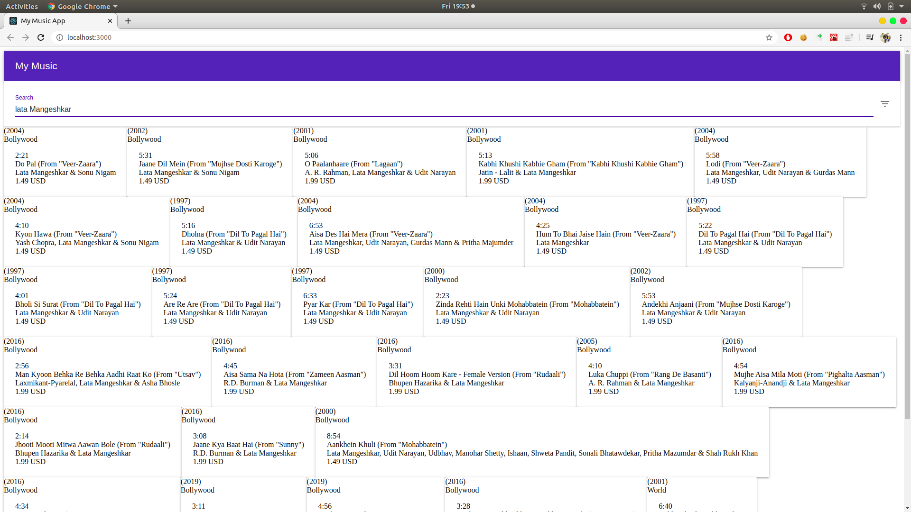

## Get started

just run:

``` javascript
npm install
// or
yarn install
```

## Get started

In From the project directory, you can run:

### `npm start`

Runs the app in the development mode.<br>
Open [http://localhost:3000](http://localhost:3000) to view it in the browser.

##ScreenShot








